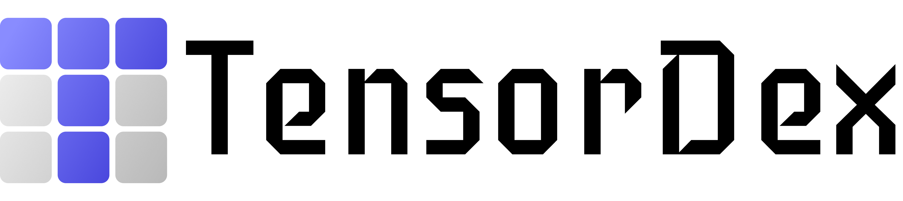
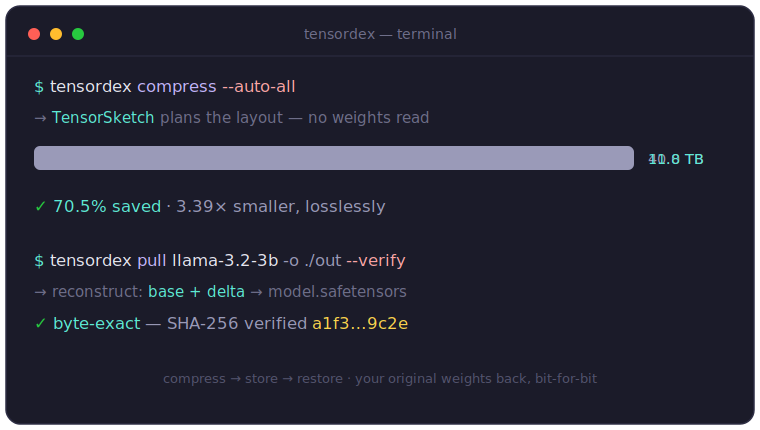

<p align="center">
  <picture>
    <source media="(prefers-color-scheme: dark)" srcset="assets/tensordex-logo-dark.png">
    
  </picture>
</p>

<h3 align="center">
Tensor-centric storage for AI model hubs
</h3>

<p align="center">
| <a href="#artifact-evaluation-sosp-26"><b>Artifact Evaluation</b></a> | <a href="https://tingfenglan.com/tensordex/"><b>Landing Page</b></a> | <a href="#quickstart"><b>Quickstart</b></a> | <a href="#architecture"><b>Architecture</b></a> |
</p>

<p align="center">
  <a href="LICENSE"></a>
  
  
</p>

---

*Latest News* 🔥 — TensorDex is open source: cut your model-hub storage by **~70%**, losslessly — tensor-level dedup + delta compression for the fine-tunes and checkpoints that bloat every hub.

---

<p align="center">
  
</p>

## Artifact Evaluation (SOSP '26)

SOSP'26 artifact reviewers: start at [`ae/README.md`](ae/README.md), or run
`make ae-help`. The paper's results reproduce at three tiers of effort:
re-plot every figure from the published
[`results.db` cache](https://huggingface.co/datasets/tensordex/tensordex-ae-cache)
(~10 min); verify a random sample of that cache by re-deriving it bit-for-bit
from raw tensor bytes (seconds per 200-pair sample); or run the full pipeline
end-to-end. Each paper claim maps to one command, and `make reproduce-all`
runs everything offline. The Artifact Appendix lives at
[`ae/appendix/appendix.pdf`](ae/appendix/appendix.pdf).

## About

TensorDex is a drop-in storage layer for **AI model hubs**. It deduplicates and compresses model weights at the **tensor level** — not the file level — so the fine-tunes and checkpoints that dominate a hub stop costing a full copy each. Identical tensors are stored once; the rest are kept as compact deltas against the closest match anywhere in the hub, and every model reconstructs to an exact `.safetensors` on demand.

The payoff on real HuggingFace models: **70.5% less storage** (3.39× smaller), losslessly, and fast enough to stay out of your way (22.9 / 28.4 GB/s compress / decompress).

**Highlights**

- **Tensor-level dedup** — every tensor keyed by XXH3-128; identical tensors stored once across the whole hub.
- **Cross-model deltas** — divergent tensors encoded against the closest base anywhere, chosen automatically from 8 KB **TensorSketch** fingerprints — no reading full weights, no trial compression.
- **Lossless** — `pull` rebuilds byte-exact `.safetensors`; `--verify` re-hashes every tensor.
- **Fast** — Rust-accelerated ingest and the `tensorx` delta codec; 22.9 / 28.4 GB/s.
- **HuggingFace-native** — `tensordex download org/model` ingests straight from the Hub.

## Performance

How much smaller, vs. other approaches, on real HuggingFace models (stored size as a fraction of uncompressed — lower is better):

| System | Stored | Notes |
| --- | --- | --- |
| Uncompressed | `100%` | baseline |
| OpenZL | `78%` | general-purpose |
| ZipNN | `67%` | weight-aware |
| FM-Delta | `59%` | delta codec |
| ZipLLM | `47%` | prior state of the art |
| **TensorDex** | **`29%`** | **70.5% saved · 3.39× smaller** |

## Install

TensorDex builds a Rust extension, so you need a **Rust toolchain (≥ 1.78)** alongside **Python ≥ 3.8**.

```bash
# 1. Install / update Rust (skip if you already have rustup on a recent stable)
curl --proto '=https' --tlsv1.2 -sSf https://sh.rustup.rs | sh -s -- -y
source "$HOME/.cargo/env"
rustup default stable
cargo --version            # must be ≥ 1.78

# 2. Build + install TensorDex
pip install .              # or: uv pip install .   (add -e for an editable dev build)
```

> **Note on old system Rust:** if `/usr/bin/cargo` (apt's) exists, rustup installs alongside it — make sure `~/.cargo/bin` comes first on your `PATH` (`source "$HOME/.cargo/env"` does this) so the newer toolchain wins. A too-old cargo fails with `lock file version 4 requires -Znext-lockfile-bump`.

Extras: `".[server]"` (HTTP serving), `".[s3]"` (S3 backend), `".[dev]"` (tests + lint).

## Quickstart

The fastest way to see TensorDex end-to-end — **download a checkpoint series, compress it, and load a model back out byte-exact** — is the bundled example:

```bash
pip install .                             # build the Rust extension (needs a Rust toolchain)
python examples/compress_checkpoints.py   # 8 adjacent Pythia-160m checkpoints (~4.8 GB)
```

It walks the whole lifecycle and prints the savings at each step:

```
download → ingest (tensor-level dedup) → compress (FlexSplit) → load a model back
  2.25× smaller (56% saved), lossless   ·   FlexSplit holds ~56% even at 100 checkpoints
```

Point it at your own run — `python examples/compress_checkpoints.py <repo> step1000 step2000 …` — the more, and the closer, the checkpoints, the bigger the win. Repos that ship PyTorch `.bin` are converted to safetensors on ingest automatically.

### Or drive it yourself

```bash
tensordex download EleutherAI/pythia-160m       # download + ingest from HuggingFace
tensordex compress --auto-all                   # dedup + delta-compress the hub
tensordex pull EleutherAI/pythia-160m -o ./out --verify   # exact .safetensors back, re-hashed
```

```python
from tensordex import TensorDex

hub = TensorDex("./data")
hub.download("EleutherAI/pythia-160m")
w = hub.get_tensor(model_name="EleutherAI/pythia-160m",   # load one tensor, in memory
                   param_name="embed_out.weight")
hub.pull("EleutherAI/pythia-160m", "./out")               # whole model → ./out/model.safetensors
```

See [examples/quickstart.py](examples/quickstart.py) for a minimal synthetic round-trip, and `tensordex --help` for the full CLI (`ls`, `info`, `stats`, `get`, `serve`, `gc`, …).

## Architecture

Python orchestrates I/O and exposes the API/CLI; a Rust extension (`tensordex._ops`) owns all persistent state and data processing. **SQLite is the single source of truth** for tensor metadata and the delta-base graph, so gc and remote manifests are indexed queries; blobs live content-addressed on disk at `blobs/xx/yy/<tensor_id>.safetensors`. See [docs/ROADMAP.md](docs/ROADMAP.md) for the staged plan.

## License

[Apache License 2.0](LICENSE).
